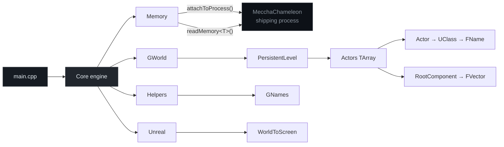

<div align="center">


</div>

---

## Overview

External cheat for **MecchaChameleon** (UE5) — built for **memory research and reverse engineering**.

The tool runs out-of-process: no injection, no hooks. It attaches to the game's shipping executable and walks core Unreal structures (`GWorld`, actor lists, `GNames`, component transforms) to understand how runtime state is laid out in memory.

> Work in progress. Foundation layer is in place; gameplay-facing features are planned below.

<br/>

## Contents

- [Current scope](#current-scope)
- [Planned features](#planned-features)
- [Architecture](#architecture)
- [Project layout](#project-layout)
- [Requirements](#requirements)
- [Build & run](#build--run)
- [Offsets](#offsets)
- [Roadmap](#roadmap)
- [Disclaimer](#disclaimer)

---

## Current scope

| Area | Description | Status |
|:-----|:------------|:------:|
| **Process I/O** | External attach via `ReadProcessMemory` | done |
| **World chain** | Resolve `GWorld → PersistentLevel → Actors` | done |
| **FName pool** | Decode entries from `GNames` | done |
| **Actor walk** | Read class names, `RootComponent`, transforms | done |
| **Projection** | `WorldToScreen` math (`FMinimalViewInfo → FVector2D`) | WIP |
| **View info** | Read camera / `FMinimalViewInfo` from live process | planned |

---

## Planned features

### ESP

| Feature | Description |
|:--------|:------------|
| **Box ESP** | 2D bounding boxes around actors via world-to-screen |
| **Skeleton ESP** | Bone chain overlay for humanoid meshes |
| **Name / distance** | Actor class name and distance from local player |
| **Snaplines** | Lines from screen center or bottom to target |
| **Health / state** | Optional bars or flags when offsets are known |
| **Chinese hat** | RGB hat above players |

### Aimbot *(maybe)*

| Feature | Description |
|:--------|:------------|
| **Target selection** | Closest to crosshair, lowest HP, etc. |
| **Bone aim** | Head / chest / configurable bone index |
| **FOV limit** | Only acquire targets inside a radius |
| **Smoothing** | Interpolated aim delta instead of snap |
| **Visibility check** | Skip actors behind geometry when trace data exists |

> Aimbot is not committed yet — listed as a possible research extension once actor filtering and view matrices are stable.

---

## Architecture



**Pointer chain resolved at init:**

```
BaseAddress + GWorld
    └── UWorld::PersistentLevel
            └── ULevel::Actors (TArray)
                    └── AActor
                            ├── UClass  → FName
                            └── USceneComponent (Root)
                                    ├── RelativeLocation
                                    ├── RelativeRotation
                                    └── RelativeScale3D
```

---

## Project layout

```
MecchaChameleon/                          # repo / solution root
├── MecchaChameleon.slnx
└── MecchaChameleon/
    ├── MecchaChameleon.vcxproj
    └── MecchaChameleon/
        ├── main.cpp
        └── Engine/
            ├── offsets.hpp
            ├── types.hpp
            ├── helpers.hpp
            ├── Memory/
            ├── MecchaChameleon/          # core module (internal name)
            └── Unreal/
```

---

## Requirements

| | |
|:--|:--|
| OS | Windows 10 / 11 (x64) |
| IDE | Visual Studio 2026, MSVC v145 |
| Language | C++20 |
| Target | MecchaChameleon UE5 shipping build |

---

## Build & run

```bash
git clone https://github.com/ToldByNun/MecchaChameleon-External-Cheat.git
cd MecchaChameleon-External-Cheat
```

Open `MecchaChameleon/MecchaChameleon.slnx`, set **Release · x64**, then build.

MecchaChameleon must be running before launch. Init blocks until the `GWorld` chain resolves.

**Expected console output:**

```text
[+] BaseAddress                    : 0x7FF6A0000000
[+] GWorld                         : 0x7FF6A0B21F0
[+] PersistentLevel                : 0x...
[+] Actors                         : SUCCESS [Count: 142] at 0x...
Name: BP_PlayerCharacter_C
[+] RelativeLocation               : SUCCESS X: 1200 Y: 340 Z: 90
```

---

## Offsets

Defined in `offsets.hpp`. Version-specific to the current MecchaChameleon build — re-derive after patches.

| Symbol | Value | Role |
|:-------|:------|:-----|
| `GWorld` | `0xA0B21F0` | Global world pointer |
| `GNames` | `0x9E40280` | FName string pool |
| `PersistentLevel` | `+0x30` | `UWorld` → active level |
| `Actors` | `+0xA0` | Level actor array |
| `RootComponent` | `+0x1B8` | Actor scene root |
| `RelativeLocation` | `+0x140` | Component translation |

---

## Roadmap

**Foundation**

- [x] External process attach & typed memory reads
- [x] `GWorld` actor-chain resolution
- [x] `GNames` / FName decoding
- [x] Root-component transform reads
- [x] World-to-screen projection math
- [ ] Live `FMinimalViewInfo` extraction
- [ ] Overlay render loop (DirectX / ImGui)

**ESP**

- [ ] Box ESP
- [ ] Skeleton ESP
- [ ] Name / distance labels
- [ ] Snaplines
- [ ] Chinese hat

**Aimbot** *(TBD)*

- [ ] Target selection & FOV filter
- [ ] Bone-based aim
- [ ] Smoothing

---

## Disclaimer

Educational and research use only — reverse engineering and external memory layout analysis.

Do not use against live multiplayer services or in violation of any terms of service. The author accepts no liability for misuse.

---

<div align="center">


<sub><a href="https://github.com/ToldByNun">ToldByNun</a></sub>

</div>
