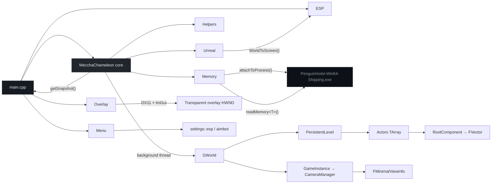

<div align="center">


</div>

---

## Overview

External cheat for **MecchaChameleon** (UE5) — built for **memory research and reverse engineering**.

The tool runs out-of-process: no injection, no hooks. It attaches to the game's shipping executable and walks core Unreal structures (`GWorld`, actor lists, `GNames`, component transforms, camera POV) to understand how runtime state is laid out in memory. A transparent DXGI overlay (DirectX 11 + ImGui) renders on top of the game window.

> Work in progress. Memory chain, background polling, overlay, and menu are in place. ESP features are partially wired; aimbot remains placeholder UI only.

<br/>

## Contents

- [Current scope](#current-scope)
- [Planned features](#planned-features)
- [Architecture](#architecture)
- [Project layout](#project-layout)
- [Requirements](#requirements)
- [Build & run](#build--run)
- [Controls](#controls)
- [Offsets](#offsets)
- [Roadmap](#roadmap)
- [Disclaimer](#disclaimer)

---

## Current scope

| Area | Description | Status |
|:-----|:------------|:------:|
| **Process I/O** | External attach via `ReadProcessMemory` | done |
| **World chain** | Resolve `GWorld → PersistentLevel → Actors` | done |
| **FName pool** | Decode entries from `GNames` | done |
| **Actor walk** | Read class names, `RootComponent`, transforms | done |
| **Camera chain** | `GameInstance → LocalPlayer → PlayerController → CameraManager` | done |
| **View info** | Live `FMinimalViewInfo` from `PlayerCameraManager` | done |
| **Projection** | `WorldToScreen` (`FMinimalViewInfo → FVector2D`) | done |
| **Background poll** | Mutex-protected actor/camera snapshot on a worker thread | done |
| **Overlay** | Transparent Win32 window, DXGI 11, ImGui render loop | done |
| **Menu** | ImGui tabs (ESP / Aimbot / Misc), `INSERT` toggle | done |
| **Snaplines ESP** | Lines from screen bottom to projected actor positions | WIP |
| **Box / skeleton / labels** | Menu toggles present, rendering not implemented | planned |
| **Aimbot** | Menu toggles present, no aim logic yet | planned |

---

## Planned features

### ESP

| Feature | Description |
|:--------|:------------|
| **Box ESP** | 2D bounding boxes around actors via world-to-screen |
| **Skeleton ESP** | Bone chain overlay for humanoid meshes |
| **Name / distance** | Actor class name and distance from local player |
| **Snaplines** | Lines from screen center or bottom to target |
| **Health / state** | Optional bars or flags when offsets are known |
| **Chinese hat** | RGB hat above players |

### Aimbot *(maybe)*

| Feature | Description |
|:--------|:------------|
| **Target selection** | Closest to crosshair, lowest HP, etc. |
| **Bone aim** | Head / chest / configurable bone index |
| **FOV limit** | Only acquire targets inside a radius |
| **Smoothing** | Interpolated aim delta instead of snap |
| **Visibility check** | Skip actors behind geometry when trace data exists |

> Aimbot is not committed yet — listed as a possible research extension once actor filtering and view matrices are stable.

---

## Architecture



**Pointer chains resolved at init / update:**

```
BaseAddress + GWorld
    └── UWorld::PersistentLevel
            └── ULevel::Actors (TArray)
                    └── AActor
                            ├── UClass  → FName
                            └── USceneComponent (Root)
                                    ├── RelativeLocation
                                    ├── RelativeRotation
                                    └── RelativeScale3D

BaseAddress + GWorld
    └── UWorld::OwningGameInstance
            └── LocalPlayers (TArray)
                    └── ULocalPlayer::PlayerController
                            └── APlayerCameraManager
                                    └── FMinimalViewInfo (CameraInfo)
```

**Runtime loop (`main.cpp`):** sync overlay to game window → poll input → read snapshot → ImGui frame → optional ESP draw → present. Settings live in `settings` (`Menu.hpp` / `Menu.cpp`) as a single shared instance (`extern` in header, definition in `Menu.cpp`).

---

## Project layout

```
MecchaChameleon/                          # repo / solution root
├── README.md
├── MecchaChameleon.slnx
└── MecchaChameleon/
    ├── MecchaChameleon.vcxproj
    └── MecchaChameleon/
        ├── main.cpp
        ├── Engine/
        │   ├── offsets.hpp
        │   ├── types.hpp
        │   ├── helpers.hpp
        │   ├── Memory/
        │   ├── MecchaChameleon/          # core module (attach, update, snapshot)
        │   ├── Unreal/                   # WorldToScreen
        │   └── ImGui/                    # vendored Dear ImGui + DX11/Win32 backends
        └── Modules/
            ├── Overlay/                  # transparent DXGI overlay window
            ├── Menu/                     # ImGui menu + shared settings
            └── Esp/                      # ESP draw helpers
```

---

## Requirements

| | |
|:--|:--|
| OS | Windows 10 / 11 (x64) |
| IDE | Visual Studio 2026, MSVC v145 |
| Language | C++20 |
| Target | MecchaChameleon UE5 shipping build (`PenguinHotel-Win64-Shipping.exe`) |

---

## Build & run

```bash
git clone https://github.com/ToldByNun/MecchaChameleon-External-Cheat.git
cd MecchaChameleon-External-Cheat
```

Open `MecchaChameleon/MecchaChameleon.slnx`, set **Release · x64**, then build.

The game must be running before launch. The tool attaches to `PenguinHotel-Win64-Shipping.exe` and opens a click-through overlay aligned to the game window.

**Expected console output (init):**

```text
[+] BaseAddress                    : 0x7FF6A0000000
[+] GWorld                         : 0x7FF6A0B21F0
[+] PersistentLevel                : 0x...
[+] Actors                         : SUCCESS [Count: 142] at 0x...
[+] Overlay running. Press INSERT to toggle menu.
[update] ok | level actors=142 | tracked=38 | cam=(1200, 340, 90) fov=90
```

---

## Controls

| Key | Action |
|:----|:-------|
| **INSERT** | Toggle ImGui menu (overlay becomes interactive while open) |

Menu tabs: **ESP** (box, skeleton, name/distance, snaplines), **Aimbot** (enabled, FOV, smoothing — UI only), **Misc**.

---

## Offsets

Defined in `offsets.hpp`. Version-specific to the current MecchaChameleon build — re-derive after patches.

| Symbol | Value | Role |
|:-------|:------|:-----|
| `GWorld` | `0xA0B21F0` | Global world pointer |
| `GNames` | `0x9E40280` | FName string pool |
| `PersistentLevel` | `+0x30` | `UWorld` → active level |
| `OwningGameInstance` | `+0x228` | `UWorld` → game instance |
| `Actors` | `+0xA0` | Level actor array |
| `RootComponent` | `+0x1B8` | Actor scene root |
| `RelativeLocation` | `+0x140` | Component translation |
| `LocalPlayers` | `+0x38` | `UGameInstance` → local player array |
| `PlayerController` | `+0x30` | `ULocalPlayer` → controller |
| `PlayerCameraManager` | `+0x360` | `APlayerController` → camera manager |
| `CameraInfo` | `+0x1540` | `FMinimalViewInfo` in camera manager |

---

## Roadmap

**Foundation**

- [x] External process attach & typed memory reads
- [x] `GWorld` actor-chain resolution
- [x] `GNames` / FName decoding
- [x] Root-component transform reads
- [x] World-to-screen projection math
- [x] Live `FMinimalViewInfo` extraction
- [x] Background update thread + thread-safe snapshot
- [x] Overlay render loop (DirectX 11 / ImGui)
- [x] ImGui menu & shared settings

**ESP**

- [ ] Box ESP
- [ ] Skeleton ESP
- [ ] Name / distance labels
- [x] Snaplines (first pass — toggle in menu)
- [ ] Chinese hat

**Aimbot** *(TBD)*

- [ ] Target selection & FOV filter
- [ ] Bone-based aim
- [ ] Smoothing

---

## Disclaimer

Educational and research use only — reverse engineering and external memory layout analysis.

Do not use against live multiplayer services or in violation of any terms of service. The author accepts no liability for misuse.

---

<div align="center">


<sub><a href="https://github.com/ToldByNun">ToldByNun</a></sub>

</div>
