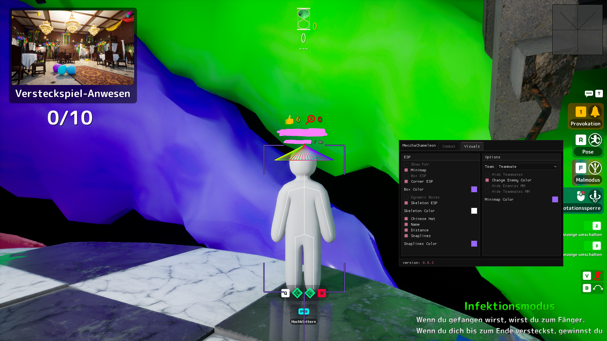
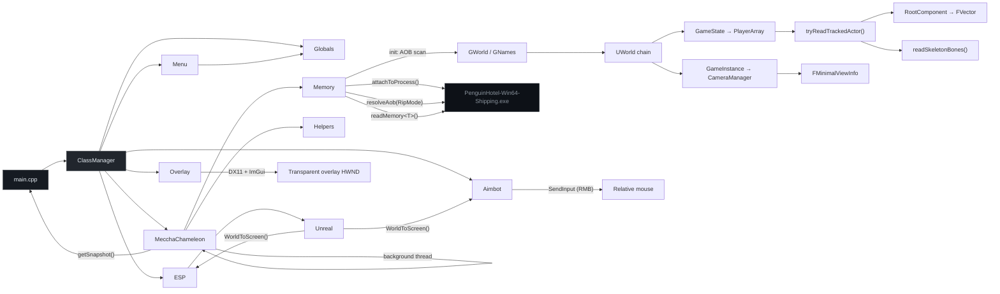

<div align="center">


</div>

---

## Preview

<div align="center">



<sub>Minimap radar · per-feature <b>ColorPicker</b> · <b>Combat</b> / <b>Visuals</b> · toggle with <b>INSERT</b></sub>

</div>

---

## Overview

External cheat for **MecchaChameleon** (UE5) — built for **memory research and reverse engineering**.

The tool runs out-of-process: no injection, no hooks. It attaches to the game's shipping executable, scans for `GWorld` / `GNames` via AOB patterns with RIP-relative resolution, and walks core Unreal structures (world chain, `GameState` player array, skeletal mesh bones, head/capsule sizing, camera POV) to understand how runtime state is laid out in memory. A transparent DXGI overlay (DirectX 11 + ImGui) renders on top of the game window.

> **v0.0.3** — minimap radar with facing arrows, dynamic bone-fitted ESP boxes, per-feature **ColorPicker** + team **Dropdown**, Chinese hat with head-bone orientation, and shared screen-bounds helpers for box/corner ESP. Includes skeleton, corner ESP, FoV circle, aimbot target-lock, and world-pointer re-resolution from prior releases.

<br/>

## Contents

- [Preview](#preview)
- [Current scope](#current-scope)
- [Planned features](#planned-features)
- [Architecture](#architecture)
- [Project layout](#project-layout)
- [Requirements](#requirements)
- [Build & run](#build--run)
- [Controls](#controls)
- [Offsets & patterns](#offsets--patterns)
- [Roadmap](#roadmap)
- [Disclaimer](#disclaimer)

---

## Current scope

| Area | Description | Status |
|:-----|:------------|:------:|
| **Process I/O** | External attach via `ReadProcessMemory` | done |
| **AOB scanning** | Pattern scan + RIP resolve (`RipMode::Lea` / `RipMode::Mov`) | done |
| **FName pool** | Decode entries from AOB-resolved `GNames` | done |
| **World chain** | Resolve `UWorld → PersistentLevel`, `GameInstance`, `GameState` | done |
| **Camera chain** | `GameInstance → LocalPlayer → PlayerController → CameraManager` | done |
| **View info** | Live `FMinimalViewInfo` from `PlayerCameraManager` | done |
| **Player tracking** | `GameState → PlayerArray → Pawn → RootComponent` positions | done |
| **Player sizing** | Head capsule radius + player height from pawn components | done |
| **Mesh / bones** | Component-space bone transforms → world positions (28 bones) | done |
| **Pointer safety** | `isValidPtr` / `isValidTArray` guards on all runtime reads | done |
| **Object dumper** | `dumpObjectRefsDeep()` for RE pointer walks | done |
| **Class lifecycle** | `ClassManager` + `Globals` for init/deinit of all modules | done |
| **Projection** | `WorldToScreen` (`FMinimalViewInfo → FVector2D`) | done |
| **Background poll** | Mutex-protected actor/camera snapshot on a worker thread | done |
| **Overlay** | Transparent Win32 window, DXGI 11, ImGui render loop | done |
| **World re-resolution** | Monitors `GWorld` address vs value; re-walks chain on world change | done |
| **Menu** | Custom ImGui widgets, **Combat** / **Visuals** categories, dual-section layout | done |
| **Box ESP** | 2D bounding box — legacy foot/head sizing or dynamic bone bounds | done |
| **Dynamic boxes** | Fit box/corners to projected skeleton bone extents | done |
| **Corner ESP** | Corner-style box overlay (shared bounds with box ESP) | done |
| **Skeleton ESP** | 28-bone wireframe (spine, arms, legs — no end bones) | done |
| **Snaplines ESP** | Lines from screen bottom-center to projected actor feet | done |
| **Name / distance** | Player name, distance in metres, or combined `name / Xm` label | done |
| **FoV circle** | Crosshair-radius circle (shared size with aimbot FOV slider) | done |
| **Minimap** | Top-right radar — yaw-rotated, FOV wedge, facing arrows, per-team dots | done |
| **ESP colors** | `ColorPicker` per element (box / skeleton / snaplines / minimap) + team dropdown | done |
| **Team filter** | Hunter / Survivor / Spectator role detection, hide teammates | done |
| **Enemy colors** | Separate default vs enemy colour per ESP element | done |
| **Aimbot** | Closest-to-crosshair, target lock, FOV limit, smoothing, RMB hold | done |
| **Chinese hat** | Head-bone oriented RGB cone — menu toggle, scales with `headRadius` | done |
| **Dev mode** | `esp.devMode` — bypasses local-player / filter checks for RE testing | done |
| **Flat chams** | Experimental material swap via `writeMemory` — not in menu | WIP |

---

## Planned features

| Feature | Description |
|:--------|:------------|
| **Bone-based aim** | Aim at configurable bone index instead of root/head capsule |
| **Visibility check** | Skip actors behind geometry when trace data exists |
| **Flat chams** | Menu toggle + safer material swap path |
| **Config persistence** | Save / load `AppSettings` to disk |

---

## Architecture



**Init flow:**

1. `ClassManager` registers `MecchaChameleon`, `Overlay`, `Menu`, `ESP`, and `Aimbot` as `IManagedClass` instances.
2. Attach to `PenguinHotel-Win64-Shipping.exe` and read module base/size.
3. Scan the module image for AOB patterns → resolve `GWorld` (`RipMode::Mov`, dereferenced) and `GNames` (`RipMode::Lea`).
4. Walk and validate the full pointer chain (world, camera, `GameState`, player meshes).
5. Background thread calls `updateWorldPointer()` each tick — if the `UWorld*` value at the resolved `GWorld` address changes (e.g. map load), the chain is cleared and re-resolved automatically.

**Pointer chains:**

```
Module scan (AOB)
    ├── GNames  → FName pool (resolveName)
    └── GWorld  → UWorld*  (mov [rip+rel32], dereferenced)
            ├── PersistentLevel
            ├── OwningGameInstance
            │       └── LocalPlayers → PlayerController → PlayerCameraManager
            │               └── FMinimalViewInfo (CameraInfo)
            └── GameState
                    └── PlayerArray (TArray, max 128)
                            └── PlayerState → Pawn
                                    ├── HeadPosition (SphereComponent) → headRadius, playerSize
                                    ├── Mesh → ComponentSpaceTransforms → readSkeletonBones()
                                    └── RootComponent → RelativeLocation
```

**Runtime loop (`main.cpp`):** sync overlay to game window → poll input → read snapshot → ImGui frame → `ESP::renderESP()` (box/corners/skeleton/labels/snaplines/chinese hat/FoV circle/minimap) → `Aimbot::onAimbot()` when actors present → present. Shared state lives in `globals` (`Manager/Globals/Globals.hpp`).

**Minimap:** 160×160 px radar (top-right). Rotates with camera yaw, draws local FOV wedge, plots actors within 12 000 uu with directional arrows derived from head bones. Per-team dot colours + optional hide filters.

**Aimbot behaviour:**

- Picks closest enemy to **screen centre** (crosshair), not OS cursor position.
- **Target lock** — stays on the same pawn while RMB is held; clears on release.
- Moves aim via `SendInput` relative mouse delta (works with raw-input games).
- Optional FOV radius filter and smoothing (`smooth = 1` when smoothing is off).

**Skeleton bone map (28 bones, index 0–27):**

`root → pelvis → spine → neck → head` · arms to hands · legs to feet (no `*_end` bones drawn).

---

## Project layout

```
MecchaChameleon/                          # repo / solution root
├── README.md
├── Assets/
│   └── preview.png                       # screenshot for README
├── MecchaChameleon.slnx
├── Research (ignore this)/               # local RE notes, patterns, IDA helpers
└── MecchaChameleon/
    ├── MecchaChameleon.vcxproj
    └── MecchaChameleon/
        ├── main.cpp
        ├── Manager/
        │   ├── Classmanager/             # IManagedClass lifecycle
        │   └── Globals/                  # shared pointers + AppSettings
        ├── Engine/
        │   ├── offsets.hpp               # struct offsets + AOB patterns
        │   ├── types.hpp                 # UE structs + kSkeletonBoneCount
        │   ├── helpers.hpp               # FName resolution
        │   ├── Memory/                   # attach, read, AOB scan, RIP resolve
        │   ├── MecchaChameleon/          # core module (init, update, snapshot)
        │   ├── Unreal/                   # WorldToScreen
        │   └── ImGui/                    # vendored Dear ImGui + DX11/Win32 backends
        │       └── Custom/               # themed widgets (MainGui, TopBar, Toggle, Slider, ColorPicker, Dropdown, …)
        └── Modules/
            ├── Overlay/                  # transparent DXGI overlay window
            ├── Menu/                     # ImGui menu
            ├── Esp/                      # ESP draw helpers
            └── Aimbot/                   # relative-mouse aim assist
```

---

## Requirements

| | |
|:--|:--|
| OS | Windows 10 / 11 (x64) |
| IDE | Visual Studio 2026, MSVC v145 |
| Language | C++20 |
| Target | MecchaChameleon UE5 shipping build (`PenguinHotel-Win64-Shipping.exe`) |

---

## Build & run

```bash
git clone https://github.com/ToldByNun/MecchaChameleon-External-Cheat.git
cd MecchaChameleon-External-Cheat
```

Open `MecchaChameleon/MecchaChameleon.slnx`, set **Release · x64**, then build.

The game must be running before launch. The tool attaches to `PenguinHotel-Win64-Shipping.exe`, scans for `GWorld` / `GNames`, validates the pointer chain, and opens a click-through overlay aligned to the game window.

**Expected console output (init):**

```text
[+] Successfully attached to PenguinHotel-Win64-Shipping.exe!
[+] PID: 12345 | Base: 0x7FF6A0000000
[+] Game window found.
[+] BaseAddress                    : 0x7FF6A0000000
[+] PersistentLevel                : 0x...
[+] GameInstance                   : 0x...
[+] LocalPlayers                   : SUCCESS [Count: 1] at 0x...
[+] LocalPlayer                    : 0x...
[+] PlayerController               : 0x...
[+] CameraManager                  : 0x...
[+] ViewInfo                       : SUCCESS X: 1200 Y: 340 Z: 90
[+] GameState                      : 0x...
[+] PlayerArray                    : SUCCESS [Count: 8] at 0x...
[+] Overlay running. Press INSERT to toggle menu.
```

If an AOB pattern fails to match after a game update, update the patterns in `offsets.hpp` (see `Research (ignore this)/` for notes).

---

## Controls

| Key | Action |
|:----|:-------|
| **INSERT** | Toggle ImGui menu (overlay becomes interactive while open) |
| **Right mouse button** | Hold while aimbot is enabled to lock onto closest target |

**Combat** — aimbot enable, FOV limit, smoothing (+ sliders when toggled on).

**Visuals** — FoV circle, minimap, box, corners, dynamic boxes, skeleton, chinese hat, name, distance, snaplines (+ per-element colour pickers). **Options** — team dropdown (edit enemy vs teammate colours), hide teammates, hide enemies/teammates on minimap, minimap colour.

Enable both **Name** and **Distance** for combined `PlayerName / 12m` labels. **Dynamic Boxes** fits box/corner bounds to projected bone extents instead of the legacy foot/head height estimate.

Footer shows current version (`0.0.3`).

---

## Offsets & patterns

Defined in `offsets.hpp`. Struct offsets are version-specific — re-derive after patches. `GWorld` and `GNames` are resolved at runtime via AOB scan and stored in `Offsets::GWorld` / `Offsets::GNames`.

### AOB patterns (current build)

| Symbol | Pattern | Instruction offset | RIP mode |
|:-------|:--------|:-----------------|:---------|
| `GWorld` | `44 38 2D ?? ?? ?? ?? 48 8B 1D ?? ?? ?? ?? 74 ?? 48 85 DB 74 ?? 48 8B CB E8 ?? ?? ?? ??` | `+0x7` | `Mov` (deref) |
| `GNames` | `80 3D ?? ?? ?? ?? 00 0F 84 ?? ?? ?? ?? 48 8D 05 ?? ?? ?? ?? E9 ?? ?? ?? ??` | `+0xD` | `Lea` |

`Memory::resolveAob()` locates the pattern in the module image, resolves the `rip+rel32` target, and optionally dereferences for `RipMode::Mov`.

### Struct offsets

| Symbol | Value | Role |
|:-------|:------|:-----|
| `PersistentLevel` | `+0x30` | `UWorld` → active level |
| `OwningGameInstance` | `+0x228` | `UWorld` → game instance |
| `GameState` | `+0x1B0` | `UWorld` → game state |
| `Actors` | `+0xA0` | Level actor array |
| `RootComponent` | `+0x1B8` | Actor scene root |
| `RelativeLocation` | `+0x140` | Component translation |
| `LocalPlayers` | `+0x38` | `UGameInstance` → local player array |
| `PlayerController` | `+0x30` | `ULocalPlayer` → controller |
| `LocalPawn` | `+0x2E8` | `APlayerController` → possessed pawn |
| `PlayerCameraManager` | `+0x360` | `APlayerController` → camera manager |
| `CameraInfo` | `+0x1540` | `FMinimalViewInfo` in camera manager |
| `PlayerArray` | `+0x2C0` | `AGameState` → player state array |
| `PlayerName` | `+0x340` | `APlayerState` → display name (`FString`) |
| `Pawn` | `+0x320` | `APlayerState` → possessed pawn |
| `Mesh` | `+0x418` | `APawn` → skeletal mesh component |
| `ComponentToWorld` | `+0x1E0` | Mesh component world transform |
| `CachedComponentSpaceTransforms` | `+0x5F0` | Fallback bone transform array |
| `BoneTransformStride` | `0x60` | Size of each `FTransform` entry |
| `SkeletalMesh` | `+0x578` | `USkeletalMeshComponent` → mesh asset |
| `BoneSpaceTransforms` | `+0x9A8` | Bone transform array (bone space) |
| `ComponentSpaceTransforms` | `+0x9B8` | Bone transform array (component space) |
| `HeadPosition` | `+0x400` (pawn) | `SphereComponent` for head/capsule sizing |
| `playerSize` | `+0x130` (head) | Character height used for box ESP |
| `headRadius` | `+0x540` (head) | Head sphere radius |

---

## Roadmap

**Foundation**

- [x] External process attach & typed memory reads
- [x] AOB pattern scan with RIP-relative resolution (`Lea` / `Mov`)
- [x] `GNames` / FName decoding
- [x] `UWorld` pointer chain resolution
- [x] `GameState` player array parsing
- [x] Skeletal mesh & bone transform reads
- [x] Head/capsule sizing for ESP bounds
- [x] `ClassManager` + `Globals` module lifecycle
- [x] Root-component transform reads
- [x] World-to-screen projection math
- [x] Live `FMinimalViewInfo` extraction
- [x] Background update thread + thread-safe snapshot
- [x] World-pointer monitoring + chain re-resolution
- [x] Pointer validation on runtime reads
- [x] Overlay render loop (DirectX 11 / ImGui)
- [x] Custom ImGui menu & shared settings

**ESP**

- [x] Box ESP
- [x] Corner ESP
- [x] Skeleton ESP
- [x] Name / distance labels (combined mode)
- [x] Snaplines
- [x] FoV circle
- [x] Dynamic boxes (bone-fitted bounds)
- [x] Minimap radar
- [x] Per-feature colour pickers + team dropdown
- [x] Team filter & enemy/default colours
- [x] Chinese hat (head-bone oriented)
- [ ] Config persistence

**Aimbot**

- [x] Target selection (closest to crosshair)
- [x] Target lock while key held
- [x] FOV filter & smoothing
- [x] Right-click hold keybind
- [x] `SendInput` relative mouse movement
- [ ] Bone-based aim
- [ ] Visibility check

---

## Disclaimer

Educational and research use only — reverse engineering and external memory layout analysis.

Do not use against live multiplayer services or in violation of any terms of service. The author accepts no liability for misuse.

---

<div align="center">


<sub><a href="https://github.com/ToldByNun">ToldByNun</a></sub>

</div>
